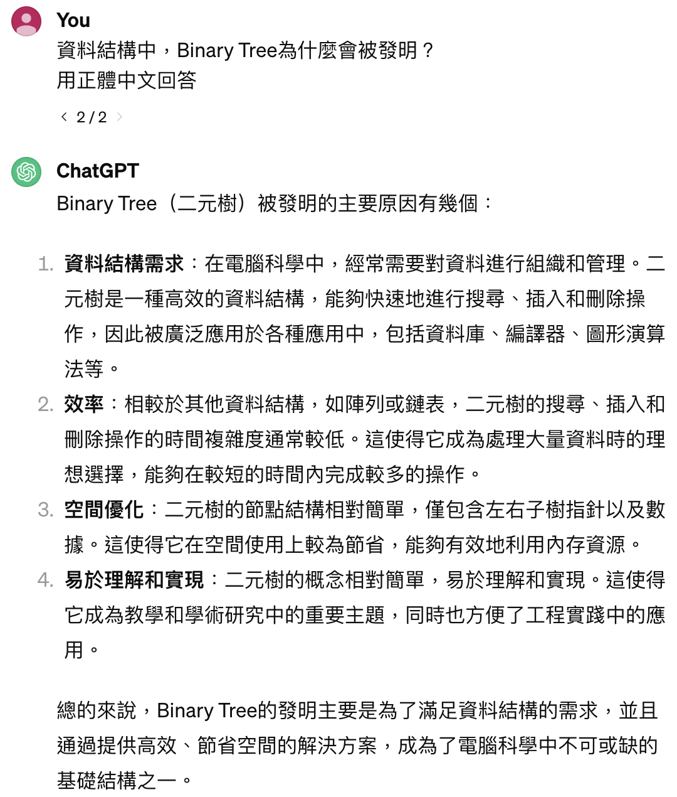
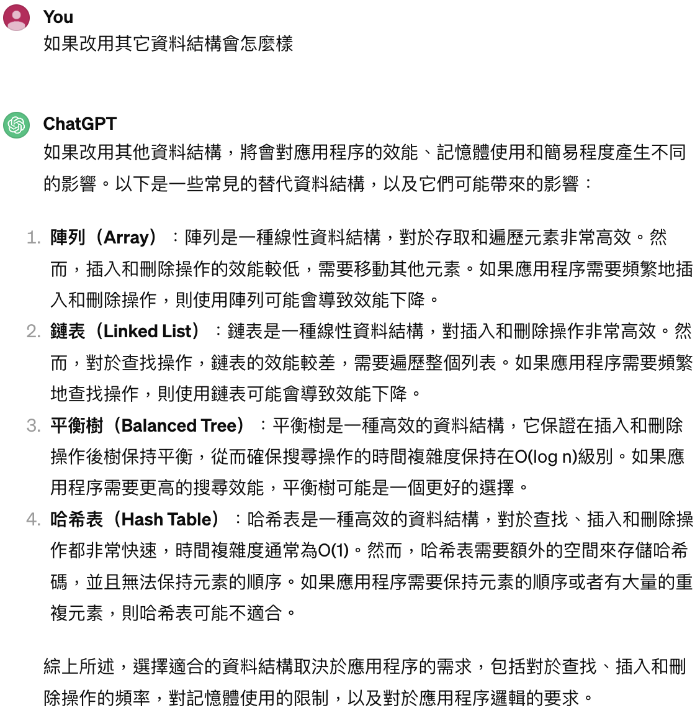

112-2 師大科技系資料結構
=============

>授課教師：蔡芸琤老師

>姓名：蔡馨雅

>系級：科技系碩三

課程筆記區
-------------
### Ｗeek 1
[PPT](https://docs.google.com/presentation/d/1XHngMihySFJdtavwBlt0JdG-9lrJmFY4-YDZOrP1eQU/edit#slide=id.p) \
[VIDEO](https://moodle3.ntnu.edu.tw/mod/url/view.php?id=750777)

### Ｗeek 2
[PPT](https://docs.google.com/presentation/d/1wX0zNiCGibklyF9yY145saurS7IyRvZY9_JwT1LnBas/edit#slide=id.g2bb9efdea17_0_215) \
[Video](https://moodle3.ntnu.edu.tw/mod/url/view.php?id=760154)

### Week 3
[PPT](https://docs.google.com/presentation/d/1E356joF2_dOmema7ki1Fh5rJ2l87XD-QU7xwpk_cbTY/edit#slide=id.p)

### Week 4
[PPT](https://docs.google.com/presentation/d/1vwAhugIA8sGYY335p7dOT2ksgsXzp9ofk44BS7vOpy4/edit#slide=id.p)

### Week 5
[LangChain Videos](https://www.youtube.com/playlist?list=PLqZXAkvF1bPNQER9mLmDbntNfSpzdDIU5) \
[LangChain](https://www.langchain.com/) \
[Video](https://www.youtube.com/watch?v=mmGquT7o8gc)

作業連結區
-------------
### Week 4
**Task:Binary Tree** \
**GhatGPT:** \
**Binary Tree 為什麼被發明？** \
 \
**Binary Tree 與其它資料結構的比較：** \
 \
**Binary Tree 程式實作練習：** \
[Google Colab](https://colab.research.google.com/drive/1J3FEhZxwMUc6RJOhiQso_OJkQ_dprNpO?usp=sharing)

### Week 5
**Task:LangChain+HuggingFace's Inference API** \
**LangChain+HuggingFace's Inference API 程式實作練習：** \
[Google Colab](https://colab.research.google.com/drive/13SR78wEyNt4FHqvmcC7b-XnyRcvE6dj-?usp=sharing) \
[Baa Baa Black Sheep.txt](https://drive.google.com/file/d/1agjMIU781mWcYYyN5SlvukWzB917bzBt/view?usp=sharing) \
[The Golden Goose.txt](https://drive.google.com/file/d/192gcmANOL8wc7-GBhRQ4pdesj9aorwmr/view?usp=sharing)

專題連結區
-------------
